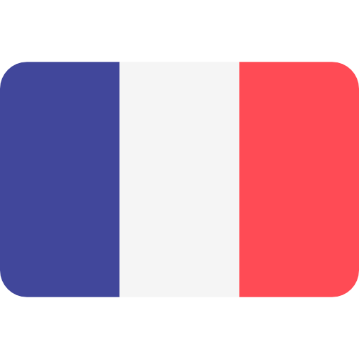

## Hello there ! 👋

<!-- Source
  - Gif : https://storyset.com
  - Markdown badge : https://github.com/Ileriayo/markdown-badges
  - Stats Github/Most used languages/Pinned repo : https://github.com/anuraghazra/github-readme-stats
  - Github profile trophy : https://github.com/ryo-ma/github-profile-trophy
  - Visitor counter : https://flagcounter.com
  - Emoji : https://emojipedia.org
-->

  <table align="right">
    <tr><td><a href="README.md"> English</a></td></tr>
    <tr><td><a href="README_fr.md"> Français</a></td></tr>
  </table>
  
  

  
  
  
  
  
  
  
  
  ## 😃 About me
  
  
  I'm Charles-Antoine BOULANGER, and I'm currently studying computer engineering at EILCO (École d'Ingénieurs du Littoral-Côte-d'Opale). So I'm from France and will soon live in Montréal to follow, in a double degree, a master's degree in computer science specialized in video games at the University of Sherbrooke.
  
  - 🎮 Passionate about science and video games, whether playing them.
  - 😉 Or coding them.
  - 🖥️ I’m currently learning Unity.
  - 👨‍💻 Most of my projects are available on Github.
  - 📝 Checkout my <a href="https://drive.google.com/file/d/1dX3RAeBv3gjTaG9tSJGfO1MGCWmJ3v2p/view?usp=sharing">resume</a>.
  - 🎯 When I am free, I do archery.
   
 
---

## 💻 Skills

  
  
  
  
  
  
  
  
  
  
  

---

## 🛠️ OS / Tools
  
  
  
  
  
  
  
  
  
  
  
  
  

---

## 📝 IDEs / Editors / Game Engines

  
  
  
  
  
  

---

## 📈 Github Statistics

  

    <!-- Favorite languages and Github stats -->
    
    &emsp;
       
    <!-- Github Profile Trophy -->
      
    <!-- Pinned Repositories -->
    
    &emsp;
     
    
    &emsp;
     
  

 ---

<!-- Visitor counter -->

